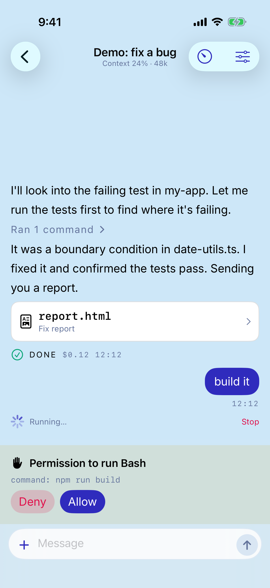

# tiny

Drive the coding agents on your Mac (Claude Code / Codex / OpenCode / Cursor) from an
iPhone app, and hand the same session back to the agent's own CLI (`claude --resume`
etc.) whenever you want.

<p align="center">
  
</p>

## Supported agents

| Agent | CLI | Transport | Login | Images | Hand back to CLI |
|---|---|---|---|---|---|
| Claude Code | `claude` | Agent SDK | `claude /login` (Claude subscription) | ○ | `claude --resume` |
| Codex | `codex` | app-server (JSON-RPC) | `codex login` (ChatGPT) | ○ | `codex resume` |
| OpenCode | `opencode` | ACP | `opencode auth login` (API key) | ○ | `opencode --session` |
| Cursor | `cursor-agent` | ACP | `cursor-agent login` | ○ | `cursor-agent --resume` |

All four are smoke-tested against the real CLIs. **Any agent that speaks ACP (Agent
Client Protocol) can be added with a single driver-definition file
(`packages/server/src/agents/<id>.ts`)** — see [CONTRIBUTING.md](CONTRIBUTING.md) for the
steps, or file an [issue](https://github.com/nasjp/tiny/issues/new?template=agent_request.yml)
to request one. Login is delegated to each agent's own CLI; tiny never holds your API
keys (`ANTHROPIC_API_KEY` and friends are stripped from child processes).

## 1. Prerequisites

- macOS + Node 22 or newer (`node --version`)
- **Install the CLI of the agent you want to use first** (login is handled per profile by
  `tiny setup`): Claude Code (`claude`) / Codex (`codex`) / OpenCode (`opencode`) /
  Cursor (`cursor-agent`). One of them is enough
- Tailscale (recommended) so the iPhone can reach the Mac from anywhere
- The tiny iPhone app (TestFlight)

## 2. Install

```bash
npm i -g @nasjp/tiny
tiny --version
```

## 3. Setup (one path)

```bash
tiny setup                            # creates the Claude profile `claude`, logs in → Tailscale URL → launchd daemon → QR
tiny setup --agent codex --profile cx # another agent / a differently named profile
```

It runs through: prerequisite checks → profile creation + login → server URL (Tailscale
IP auto-detected) → launchd daemon → pairing QR. Steps that are already done are
skipped, so it is safe to run repeatedly. Check the state anytime with `tiny doctor`.

## 4. Scan the QR on the iPhone

Scan the QR from the app's Pairing screen and the session list opens. Re-display the QR
anytime with `tiny pair`.

## Updating

```bash
npm i -g @nasjp/tiny@latest && tiny daemon install   # the plist bakes absolute paths to tiny and node, so re-run after updating
tiny doctor
```

If you installed via pnpm global / volta, the bin resolves to a versioned real path —
always re-run `tiny daemon install` after updating (a forgotten re-install is caught by
`tiny doctor` as "plist points to a missing file").

## Everyday commands

```bash
tiny doctor                              # environment diagnosis (node / daemon / server URL / push / each agent's presence and login)
tiny agents                              # list supported agents

tiny ls                                  # list sessions
tiny new --profile <name> --cwd <dir>    # create a session
tiny attach <first 8 chars of id>        # hand the session to that agent's CLI (returns to tiny when it exits)

tiny profiles ls                         # list profiles
tiny profiles add <name> --agent <id>    # add one (then: tiny profiles login <name>)
tiny profiles rename <old> <new>

tiny daemon install                      # run under launchd (use tiny serve to run in the foreground)
tiny daemon uninstall
tiny config --server-url http://<Tailscale IP>:7777
```

For development (pnpm, tsx, tests, smoke scripts, iOS builds) see
[CONTRIBUTING.md](CONTRIBUTING.md).

## Push notifications

When tinyd on the Mac detects a pending permission, a finished turn, or an error, it
encrypts the content with ChaCha20-Poly1305, sends it to the push relay (Cloudflare
Workers), and the relay forwards it to APNs. The relay holds only the p8 key and cannot
decrypt the notification contents.

```bash
# deploy the relay (if self-hosting; see packages/relay/README.md)
pnpm -C packages/relay run deploy

# tell tinyd the relay URL
tiny push config --relay https://tiny-push-relay.<subdomain>.workers.dev

# list paired devices and send a test notification
tiny devices
tiny push test
```

The notification payload contract is documented in
[docs/PUSH-PAYLOAD.md](docs/PUSH-PAYLOAD.md).

## The iPhone app

`apps/ios/Tiny` is a SwiftUI app that connects to tinyd, plus a Notification Service
Extension that decrypts notifications.

What it does: pairing / session list / chat (streaming output, tool permissions,
AskUserQuestion choices, file cards, image sending, model & effort switching, usage
display) / resuming from a tapped push notification. All verified on a real device.

Currently distributed via TestFlight (App Store submission in preparation).

```bash
# build (xcodegen generate is mandatory after touching project.yml)
cd apps/ios/Tiny
xcodegen generate
open Tiny.xcodeproj   # pick a device/simulator in Xcode and hit ⌘R
```

Pairing steps:

1. Start tinyd on the Mac and run `tiny pair` to display the QR
2. Scan it in the app → it receives `deviceId` / `bearerToken` / `e2eKey` and the
   session list opens

A **demo mode** is built in, so you can try the whole UI (chat, permission buttons, file
cards) without setting up a Mac — tap "Try demo mode" on the Pairing screen.

## Support / security

- Bugs & requests: [GitHub Issues](https://github.com/nasjp/tiny/issues) (templates provided)
- Vulnerabilities: [SECURITY.md](SECURITY.md) (please do not open a public issue)
- License: [MIT](LICENSE). Claude, Codex, OpenCode and Cursor are trademarks of their
  respective owners; tiny is an unaffiliated personal project

## Caveats

- **Do not set `ANTHROPIC_API_KEY`.** tinyd strips it from child processes, but unset it
  when running `claude` by hand too (leaving it set bills the API pay-as-you-go instead
  of your subscription)
- Turns cannot run while the Mac is asleep. For continuous use, keep it awake with
  `caffeinate -s` or your power settings
