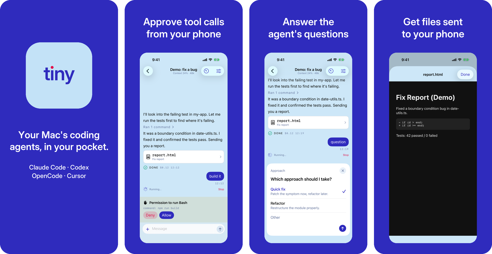

# tiny

Drive the coding agents on your Mac (Claude Code / Codex / OpenCode / Cursor) from an
iPhone app, and hand the same session back to the agent's own CLI (`claude --resume`
etc.) whenever you want.

<p align="center">
  
</p>

## Supported agents

| Agent | CLI | Transport | Login | Images | Hand back to CLI |
|---|---|---|---|---|---|
| Claude Code | `claude` | Agent SDK | `claude /login` (Claude subscription) | ○ | `claude --resume` |
| Codex | `codex` | app-server (JSON-RPC) | `codex login` (ChatGPT) | ○ | `codex resume` |
| OpenCode | `opencode` | ACP | `opencode auth login` (API key) | ○ | `opencode --session` |
| Cursor | `cursor-agent` | ACP | `cursor-agent login` | ○ | `cursor-agent --resume` |

All four are smoke-tested against the real CLIs. **Any agent that speaks ACP (Agent
Client Protocol) can be added with a single driver-definition file
(`packages/server/src/agents/<id>.ts`)** — see [CONTRIBUTING.md](CONTRIBUTING.md) for the
steps, or file an [issue](https://github.com/nasjp/tiny/issues/new?template=agent_request.yml)
to request one. Login is delegated to each agent's own CLI; tiny never holds your API
keys (`ANTHROPIC_API_KEY` and friends are stripped from child processes).

## 1. Prerequisites

- macOS + Node 22 or newer (`node --version`)
- **Install the CLI of the agent you want to use first** (login is handled per profile by
  `tiny setup`): Claude Code (`claude`) / Codex (`codex`) / OpenCode (`opencode`) /
  Cursor (`cursor-agent`). One of them is enough
- Tailscale (recommended) so the iPhone can reach the Mac from anywhere
- The tiny iPhone app (TestFlight)

## 2. Install

```bash
npm i -g @nasjp/tiny
tiny --version
```

## 3. Setup (one path)

```bash
tiny setup                            # creates the Claude profile `claude`, logs in → Tailscale URL → launchd daemon → QR
tiny setup --agent codex --profile cx # another agent / a differently named profile
```

It runs through: prerequisite checks → profile creation + login → server URL (Tailscale
IP auto-detected) → launchd daemon → pairing QR. Steps that are already done are
skipped, so it is safe to run repeatedly. Check the state anytime with `tiny doctor`.

## 4. Scan the QR on the iPhone

Scan the QR from the app's Pairing screen and the session list opens. Re-display the QR
anytime with `tiny pair`.

## Updating

```bash
npm i -g @nasjp/tiny@latest && tiny daemon install   # the plist bakes absolute paths to tiny and node, so re-run after updating
tiny doctor
```

If you installed via pnpm global / volta, the bin resolves to a versioned real path —
always re-run `tiny daemon install` after updating (a forgotten re-install is caught by
`tiny doctor` as "plist points to a missing file").

## Everyday commands

```bash
tiny doctor                              # environment diagnosis (node / daemon / server URL / push / each agent's presence and login)
tiny agents                              # list supported agents

tiny ls                                  # list sessions
tiny new --profile <name> --cwd <dir>    # create a session
tiny attach <first 8 chars of id>        # hand the session to that agent's CLI (returns to tiny when it exits)
tiny handoff                             # hand the Claude Code session you're currently in to tiny (reverse of attach)
tiny live [on|off]                       # toggle automatic handoff of every new Claude Code session (default: manual — off)

tiny profiles ls                         # list profiles
tiny profiles add <name> --agent <id>    # add one (then: tiny profiles login <name>)
tiny profiles rename <old> <new>

tiny daemon install                      # run under launchd (use tiny serve to run in the foreground)
tiny daemon uninstall
tiny config --server-url http://<Tailscale IP>:7777
```

### Running `tiny handoff` from inside Claude Code

`tiny handoff` is meant to be run *from within* the Claude Code session you want to hand
over — that is how it identifies which session you mean (Claude Code exports
`CLAUDE_CODE_SESSION_ID` to the commands it runs).

Type it with a leading `!` so it runs as a shell command:

```
!tiny handoff
```

Asking the agent in prose ("run tiny handoff") tends to misfire, because `handoff` collides
with the name of a skill in many setups — the agent invokes the skill instead of the command.
The `!` prefix bypasses the agent entirely.

If you would rather not think about it, turn on automatic handoff once:

```
tiny live on
```

Every new Claude Code session is then handed over on its own, and you never type `handoff`
again. Turn it off with `tiny live off`; it only adds two hooks to your agent's own
`settings.json` and removes exactly those when you turn it off.

### Sending to a session the CLI still has open

Once a session is handed off, you can keep the terminal open and still use it from the phone as
if nothing were different. tinyd hands your message to the running Claude Code process itself
(over its local messaging socket), so it shows up in the terminal as `› Message from @tiny: …`
and the reply reaches both places. Stop works too (the terminal abandons the turn). Attached
photos are saved under `~/.tiny/outbox` and referenced by path.

The same goes for turns you start in the terminal yourself. The phone shows them as running —
with the elapsed time and the output so far, the way Claude Code's own status line does — along
with the model's progress notes and the tools it ran, and Stop works on them just the same. Who
started a turn makes no difference to what you can do with it.

One thing stays in the terminal's hands: permission prompts. While Claude Code waits for an
answer there, the phone shows "Waiting in the terminal". Closing the terminal hands the session
back to tinyd for the next message.

Claude Code only. Requires Claude Code ≥ 2.1.251 on the Mac; tinyd falls back to refusing the
send ("open in the CLI") when it cannot reach the process.

tinyd tells Claude Code that the message comes from a session in the same permission mode as the
terminal, so a `--dangerously-skip-permissions` session takes it right away instead of parking it
behind its "held message" review prompt — the phone is treated as the same person sitting at that
terminal. Only sessions handed to tiny are reachable this way; keep `tiny live` off if you want to
hand sessions over one at a time.

For development (pnpm, tsx, tests, smoke scripts, iOS builds) see
[CONTRIBUTING.md](CONTRIBUTING.md).

## Push notifications

When tinyd on the Mac detects a pending permission, a finished turn, an error, or a
session that appeared from the Mac side (`tiny new`, `tiny handoff`, `tiny live on`), it
encrypts the content with ChaCha20-Poly1305, sends it to the push relay (Cloudflare
Workers), and the relay forwards it to APNs. The relay holds only the p8 key and cannot
decrypt the notification contents.

```bash
# deploy the relay (if self-hosting; see packages/relay/README.md)
pnpm -C packages/relay run deploy

# tell tinyd the relay URL
tiny push config --relay https://tiny-push-relay.<subdomain>.workers.dev

# list paired devices and send a test notification
tiny devices
tiny push test
```

The notification payload contract is documented in
[docs/PUSH-PAYLOAD.md](docs/PUSH-PAYLOAD.md).

## The iPhone app

`apps/ios/Tiny` is a SwiftUI app that connects to tinyd, plus a Notification Service
Extension that decrypts notifications.

What it does: pairing / session list / chat (streaming output, tool permissions,
AskUserQuestion choices, file cards, image sending, model & effort switching, usage
display) / resuming from a tapped push notification. All verified on a real device.

Currently distributed via TestFlight (App Store submission in preparation).

```bash
# build (xcodegen generate is mandatory after touching project.yml)
cd apps/ios/Tiny
xcodegen generate
open Tiny.xcodeproj   # pick a device/simulator in Xcode and hit ⌘R
```

Pairing steps:

1. Start tinyd on the Mac and run `tiny pair` to display the QR
2. Scan it in the app → it receives `deviceId` / `bearerToken` / `e2eKey` and the
   session list opens

A **demo mode** is built in, so you can try the whole UI (chat, permission buttons, file
cards) without setting up a Mac — tap "Try demo mode" on the Pairing screen.

## Support / security

- Bugs & requests: [GitHub Issues](https://github.com/nasjp/tiny/issues) (templates provided)
- Vulnerabilities: [SECURITY.md](SECURITY.md) (please do not open a public issue)
- License: [MIT](LICENSE). Claude, Codex, OpenCode and Cursor are trademarks of their
  respective owners; tiny is an unaffiliated personal project

## Caveats

- **Do not set `ANTHROPIC_API_KEY`.** tinyd strips it from child processes, but unset it
  when running `claude` by hand too (leaving it set bills the API pay-as-you-go instead
  of your subscription)
- Turns cannot run while the Mac is asleep. For continuous use, keep it awake with
  `caffeinate -s` or your power settings
